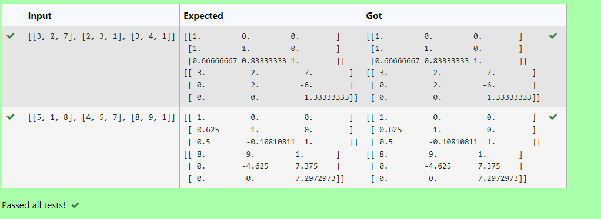
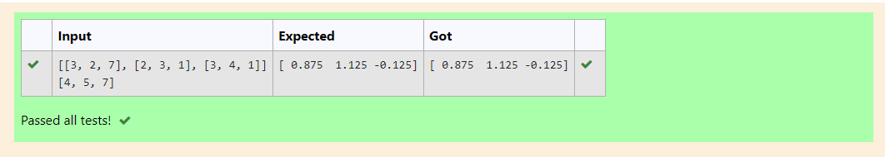

# EXPERIMENT 05
# (A)LU Decomposition to find L and U Matrix.

## AIM:
To write a program to find L and U Matrix using LU Decomposition .

## Equipments Required:
1. Hardware – PCs
2. Anaconda – Python 3.7 Installation / Moodle-Code Runner

## Algorithm
1. Import numpy module.
2. From scipy.linalg import lu.
3. Declare the given matrix to variable A.
4. Assign the values in np.array().
5. Declare P,L,U variables to lu().
6. Print L and U matrix.

## Program:
```
Program to find L and U matrix using LU decomposition.
Developed by: Rithiga Sri.B
RegisterNumber: 21500732

# To print L and U matrix
import numpy as np
from scipy.linalg import lu
A=np.array(eval(input()))
P,L,U=lu(A)
print(L)
print(U)
```

## Output:



## Result:
Thus the program to find L and U matrix using LU Decomposition is written and verified using python programming.

# (B)LU Decomposition to solve a matrix.

## AIM:
To write a program to solve a Matrix using LU Decomposition.

## Equipments Required:
1. Hardware – PCs
2. Anaconda – Python 3.7 Installation / Moodle-Code Runner

## Algorithm
1. Import numpy module.
2. From scipy.linalg import lu_factor,lu_solve.
3. Declare the given matrices to variable A and B.
4. Assign the values in np.array().
5. Declare lu,pivot variables to lu_factor(A).
6. Assign x to lu_solve((lu,pivot),B).
7. Print x.

## Program:
```
Program to solve a matrix using LU decomposition.
Developed by: Rithiga Sri.B
RegisterNumber: 21500732 

# To print X matrix (solution to the equations)
import numpy as np
from scipy.linalg import lu_factor,lu_solve
A=np.array(eval(input()))
B=np.array(eval(input()))
lu,pivot=lu_factor(A)
x=lu_solve((lu,pivot),B)
print(x)
```

## Output:



## Result:
Thus the program to solve the given matrix using LU Decomposition is written and verified using python programming.

